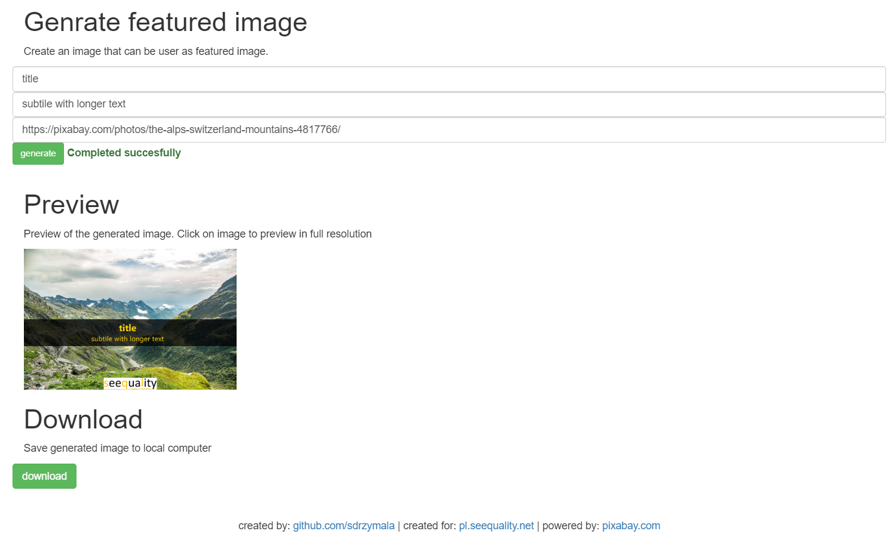

# featured-image-creator
Simple website to generate featured-images for wordpress blog

# what's inside
   * python - language
   * flask - framework
   * pixabay - api
   * docker - run, test and host

# where
Currently avaliable at: [sdrzymala.pythonanywhere.com](https://sdrzymala.pythonanywhere.com/)

# docker
build: `docker build . --tag img-featured-image-creator -f dockerfiles/standard.Dockerfile`    
build: `docker build . --tag img-featured-image-creator-alpine -f dockerfiles/alpine.Dockerfile`   
run: `docker run -d -p 5000:5000 img-featured-image-creator`

# todo
* Move pixabay api key from file
* Add dynamic logo position